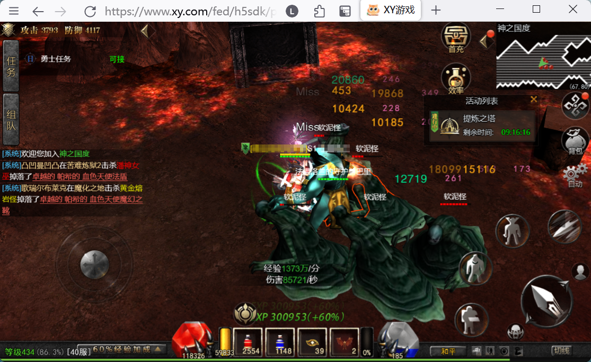

# 使用说明
适配python 3.11版本，精简包embedded[加工一下](https://stackoverflow.com/questions/42666121/pip-with-embedded-python)也行，参考后文
``` cmd
wins.py  #基础的点击、截图、窗口句柄等功能函数，须调参数：WIDTH_WIN, delta_X, delta_Y
muMod.py  #功能函数, dxcamCap适用于多屏，但是兼容性差易报错内存暴力写入, screezeCap只适用于单主屏，兼容性好
Run.py    #入口, 1100四个开关参数, Level圣域层数
#运行方式
python Run.py #小程序窗口
python Run.py XY #浏览器窗口
```

## 功能说明
在固定的几个地图刷黄金或红Boss

具体坐标点参看Run.py内容，坐标为相对坐标

### 注意事项
使用Firefox浏览器窗口时可以实现后台鼠标事件，不影响前台鼠标干别的

不过窗口不能遮挡，需要通过截图识别状态



### 精简python环境Embedded包加工方法
[下载](https://www.python.org/downloads/windows/)后解压到指定目录，修改python311._pth文件内容：
```
python311.zip
.
import site
```
下载[get-pip.py](https://bootstrap.pypa.io/get-pip.py)到同目录，拖动到python.exe图标上执行

双击init.bat打开命令行，执行`pip -r requirements.txt`安装依赖包

